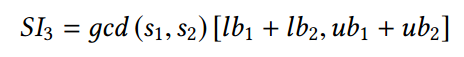
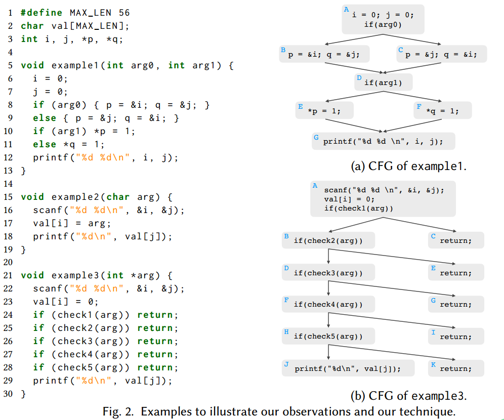
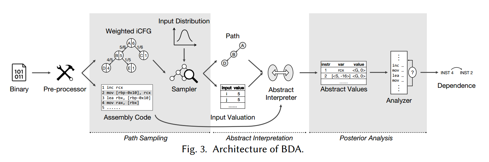
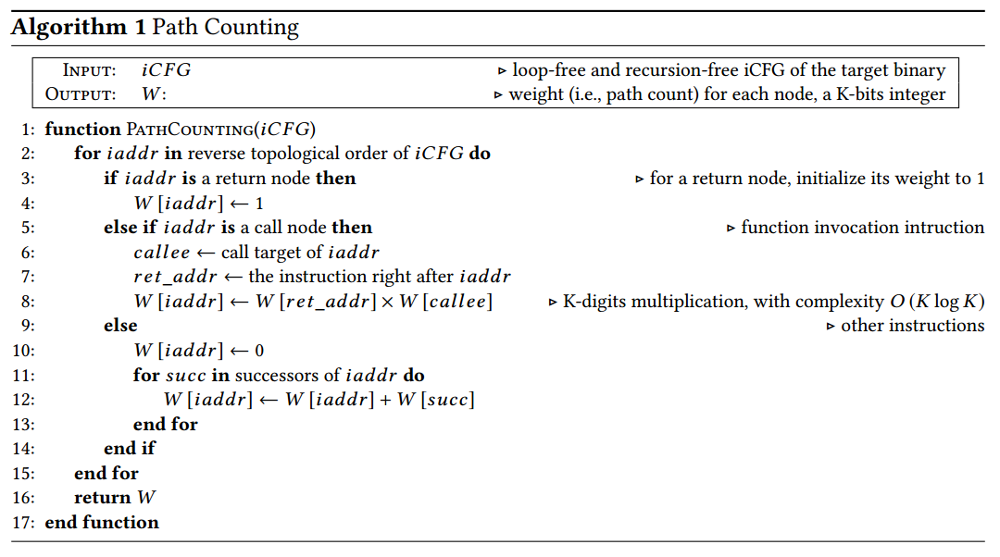
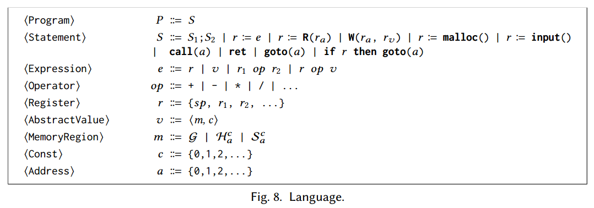
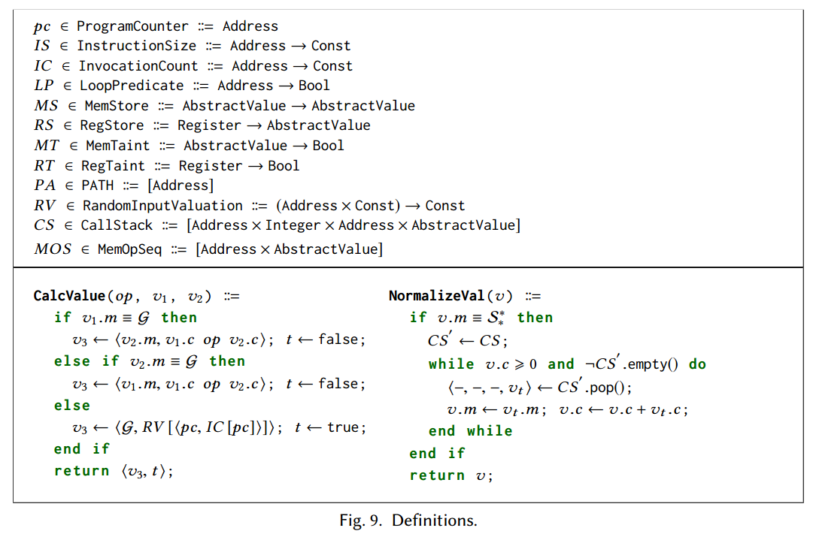
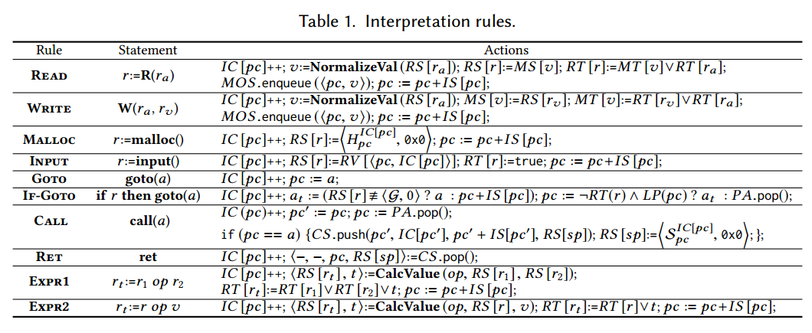
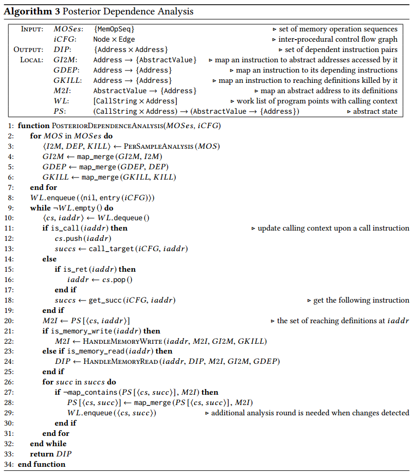

BDA: 基于无偏全程序路径采样和逐路径抽象解释的二进制程序实用依赖分析
===================================================================

作者：ZHUO ZHANG, WEI YOU, GUANHONG TAO, etc.

单位：Purdue University, Renmin University of China

来源：the ACM on Programming Languages, 2019 (OOPSLA CCF-A-C)

开源代码：<https://github.com/bda-tool/bda>

摘要
====

二进制程序依赖关系分析决定了指令之间的依赖关系，因此对于处理没有任何符号信息的可执行程序非常重要。关键挑战是识别多个内存读写指令是否访问同一个内存位置。现有最好的方法是使用值集分析value
set analysis (VSA)
，它使用抽象解释来确定可能由内存指令访问的地址集。但是VSA过于保守，导致大量的误报，给后续应用分析（如恶意软件行为分析）也带来大量误报。并且现有公开的VSA很难扩展到复杂二进制程序中。

本文采用随机抽象解释技术提出了一种新的二进制依赖分析BDA。它采用了一种新的不受路径长度影响的全程序路径采样算法，并给出了每条路径的抽象解释，避免了传统分析中合并路径造成的精度损失。它还提供了概率保证。

在SPECINT2000程序上的评估显示它能处理复杂的二进制程序，如gcc，而来自最先进平台的VSA，对于许多SPEC二进制代码很难生成结果。另外，BDA报告的依赖比Alto（一个可扩展的二进制分析工具）和VSA分别小75倍和6倍，并且在动态执行观察中仅漏报了0.19%的真实依赖。将BDA应用于调用图生成和恶意软件分析表明，BDA在恢复间接调用目标方面很大程度上取代了商业工具IDA
，在恶意软件分析方面，比最先进的恶意软件分析工具Cuckoo表现更好，多发现了3倍多的隐藏有效载荷。

1.Introduction
==============

二进制分析是很多应用的关键技术，如旧软件维护，重用，强化，去冗余，商用软件安全检测，恶意软件分析，逆向分析。程序依赖分析是二进制分析的关键，即判断两个指令之间是否存在依赖关系。二进制程序依赖分析比源码依赖分析更具挑战，因为编译过程丢失了符号信息（类型和变量），并且源码数据结构、变量和参数被编译为难以分析的寄存器和内存访问。分析还受到间接控制流干扰。二进制依赖分析的关键挑战是内存别名分析，即判断内存访问指令可能访问同样的内存地址。

目前广泛使用的二进制分析平台有IDA，CodeSurfer，BAP，ANGR。其中一些采用动态依赖分析，该方法在输入可用的情况下是有效的，但是很多安全应用中缺少输入。虽然符号执行和模糊测试可以被用来生成输入，但是他们很难扩展到复杂程序中具有复杂输入约束的长程序路径和执行状态。因此，很多平台采用静态值集分析VSA来解决内存别名问题。VSA是由Balakrishnan
and Reps
于2004年提出的。它计算每个指令的操作数的可能值的集合。通过检查两个内存访问的值集是否共享相同的地址能够判断它们的别名关系。VSA使用“跨步区间”表示一组值的集合。每个跨步区间包括下界、上界和跨步。紧凑的跨步区间具有保守特性。在很多情况，它们可能简化为值范围（以1为跨步的区间）。因此，虽然VSA是健全的，但是它在实际应用中有许多限制。许多内存访问的可能地址常常退化为整个内存空间，从而引入大量的伪依赖；当内存写的可能地址值集膨胀，写操作的开销变得非常大，因为它必须更新所有可能地址的值集。根据我们的实验，很多实现的值集分析无法在SPECINT2000上成功运行。另外，它们在依赖分析中产生大量的误报。

虽然完备性（不丢失任何正确的程序依赖）对某些应用时至关重要的，例如保留语义的二进制代码转换，但概率保证（分析低概率丢失真阳性）对很多实际应用是足够的。例如，VSA的一个基本应用：恢复间接控制流转换地址来构建精确的调用图。使用保守和完备的VSA可能有大量虚假的调用边，导致调用图不是很有用。相反地，一个分析能够发现大部分真实间接调用边，虽然有低概率丢失一些可能的边是更加有用的。在恶意软件分析中，如果偶然丢掉一些依赖不会过多影响行为报告，但是如果有大量伪造边导致误报，则会加重人工分析。在其他一些分析中，如功能模块识别、静态导向的漏洞检测/fuzzing、协议逆向，概率保证的依赖分析能提供有效性和实用性更加合适的折中方法。

因此，本文提出了一种基于随机化抽象解释技术的具有概率保证的二进制程序依赖分析技术。具体地说，我们的技术对整个程序路径的空间进行采样，采样的方式是采用均匀分布的不同路径的可能性，而不受路径长度的影响。注意，在每个分支随机选择会导致有偏差的路径选择，很难达到长路径。抽象解释是在每个采样路径上实施，区别于VSA，VSA是合并之前所有路径的抽象值。为避免使用值范围或者步长区间表示外部输入，我们的抽象解释从pre-defined
distribution“预定义分布”中采样输入值。根据采样数量可以提供概率保证。基于大量样本解释计算出的抽象值，进行了上下文敏感和流敏感的后端依赖分析。该分析能够减少因不完整路径采样导致的可能误报。它还具有强更新的特点，有效抑制误报。

本文贡献：

·提出了一种用于通用路径搜索的全程序路径采样算法。在一定的假设下，我们也确定了抽样算法的概率保证。

·我们设计了一种逐路径抽象解释技术，该技术对于避免虚假的抽象值和依赖至关重要，并通过后验分析来补偿路径采样中可能存在的不完备性。

·我们解决了许多实际的挑战，例如处理循环、递归、间接跳转和间接调用。

·我们提出了一种基于新的随机抽象解释技术的二进制程序依赖分析方法。

·我们开发了原型系统BDA并开源，并在SPECINT2000的二进制上评估了他。我们的评估表明它能够扩展到复杂二进制程序中，包括gcc，然而在流行平台BAP、ANGR上实现的VSA不能生成结果。与在标准输入上运行这些二进制文件时观察到的动态依赖性相比，BDA平均仅丢失了0.19%的依赖。BDA报告的依赖比VSA和Alto小很多。我们也在两个下游分析中评估了BDA，识别间接控制流转换和识别隐藏恶意软件行为。

2.动机
======

在二进制程序中，寄存器引起的程序依赖容易分析，内存引起的依赖存在挑战。因为确定内存操作访问的地址是很困难的。例如，一个关键挑战是确定内存访问指令的指向关系。本节解释当前技术的局限性，展示我们在程序依赖上的观察和BDA的想法。

2.1 现有技术局限性
------------------

Alto：使用\<insn,
offset\>表示变量，insn是计算基础值，offset表示相对于基础值的可能偏移集合。Alto仅对寄存器操作进行了建模，不能处理内存读写。

VSA：VSA通过抽象解释计算PRV（运行时可能值），对寄存器和内存操作进行建模。使用跨步区间s[lb,
ub]表示PRV，lb和ub分别表示上下界，s表示区间中值之间的步长。SI3 = SI1 + SI2。

VSA主要问题是过度近似。上式中求最小公约数、下界、上界都可能导致引入虚假的PRV。因为整个程序分析中存在大量的解释步骤，虚假的依赖被整合放大，导致结果不可用。

2.2 观察
--------

不同分析需要不同类型的敏感。例如，最简单的类型推断可能是路径不敏感、上下文不敏感甚至数据流不敏感的。依赖分析是流敏感、上下文敏感、路径敏感的。但是，一个关键发现是“一个内存依赖关系可以由很多条全程序路径发现”。也就是说，虽然它是上下文和路径敏感的，但是敏感度是有限的。对于一个有n条语句的程序，依赖数量是O(n\^2)，路径数量是O(2\^n)。因此，依赖关系可以有很多路径发现。如fig.2
a中，有四条路径，三条可以发现第6行和12行i的依赖关系。本质上来讲，只要有一个路径被分析就能发现依赖关系。程序依赖也是输入敏感的，在fig
2的例example2中，只有一条路径，第17和18行之间是否存在依赖关系取决于i和j的值。假设它们取值范围是[0,
c]，依赖概率是1/c，如果随机取n此i和j的值，该概率为1-(1-1/c)\^n，当n很大时接近于1。

2.3 我们的技术
--------------

我们为依赖分析提出一种基于采样的抽象解释技术。特别地，BDA根据一个新的算法，以服从均匀分布采样过程间程序路径，无路径长度偏好。也就是说，BDA能够尽可能多的采样不同的路径。对每个采样路径执行抽象解释计算每个指令可能的值。在抽象解释中，外部输入是从预定义分布中随机采样的；调用上下文表示为调用字符串；栈内存表示为带偏移的栈帧；堆内存使用分配点表示；抽象值基于指令语义更新；内存读写被建模为一个抽象存储；并对路径可行性进行了部分建模。

3.设计
======

BDA架构如图所示，包括四个部分：预处理器、采样器、抽象解释器和分析器。

预处理器：反汇编给定的二进制程序，并将调用边和返回边加入到控制流图中生成过程间的控制流iCFG。

采样器：每个基本块把可能从该基本块开始的过程间路径的数量作为其权值。采样器根据基本块权重采样路径，基于预定义分布采样外部输入。

抽象解释器：根据给定的路径和输入值，抽象解释器解释路径上的每条指令，并计算每条指令操作数的值。

后端分析器：每个指令的抽象值被传递给分析器进行后端内存依赖分析。最后BDA输出内存依赖指令对作为分析结果。

4.路径采样
==========

基本思路：在iCFG中，对于每个分支，计算从该分支开始的所有的路径的数量。采样偏好根据路径计数计算得到。直观来讲，导致更多路径的分支有更大概率被选中。

有两个挑战需要解决：

1.如何在有函数调用、循环、递归的情况下计算过程间路径的数量。

2.有种情况经常出现：一个条件分支可能有很少的路径（如错误处理），但是另一个分支有大量的路径（如超出64位整数表示范围），在这种情况下，如何进行强偏好分布抽样。

4.1 路径计数
------------

首先不考虑循环、递归和间接跳转问题，在4.3节专门进行讨论。

返回节点的权值等于1；

调用函数foo()的指令的权值等于“从foo()入口到出口的过程内路径数(包括foo()的被调函数的路径)”和“调用函数中调用指令之后指令的权重”的乘积。前者称作callee路径，后者称作continuation路径。调用节点权值等于callee路径数和continuation路径数的乘积；

其余节点权值等于后继节点权值之和。

4.2 路径采样和概率分析
----------------------

在复杂程序中，权重可能会很大2\^1000，导致概率计算变得复杂。采用指数方式表示权重，并设计了一个近似的路径采样算法，降低计算复杂度。并对采样的概率保证进行了证明。（不精确的）

4.3 解决实际挑战
----------------

处理循环：BDA识别两类循环：循环条件与输入无关的静态循环、输入相关的输入依赖循环。处理输入依赖循环比较困难，可以计算不动点，但是会带来大量过度近似；可以为每个循环设置固定循环次数，但是在循环嵌套时造成路径爆炸。本文限制一个函数内所有循环嵌套的总数。对于静态循环，本文允许他们迭代尽可能多的次数。递归的处理方法近似输入依赖循环的处理方法。

处理多个函数出口：提取包含退出函数的子图，计算权值后跟原图权值相加。

处理间接调用：采用迭代的方式，在抽象解释过程中发现间接跳转则更新iCFG。

边覆盖：无偏路径选择可能会导致某短路径很难被选择，BDA收集了额外的样本来覆盖没有被覆盖的边。

采样外部输入：从给定的值范围中随机产生输入值。

实际应用中的概率保证：理论推导过于理想化，在评估章节中对概率保证进行验证。

5.抽象解释
==========

对每个采样路径和输入进行抽象解释，避免VSA跨步区间的不准确性。

语言。使用低级语言建模二进制执行。R(ra)和W(ra,
rv)表示内存读写操作。堆分配建模为malloc，我们分析与堆大小无关，因此省略。外部输入函数建模为input。其他普通函数调用和返回建模为call和ret。假设参数传递通过显示地读写内存或寄存器。建模栈指针sp来计算栈相关的值。控制流指令被建模为goto。

抽象值表示为\<m,
c\>，m是内存区域、c表示相对于内存基址的偏移。内存空间被划分成为三个不相交的区域：全局、栈、堆。全局使用G表示，表示保存全局数据的地方，如ELF文件中.data、.rodata和.bss段。栈空间表示为Sa\^c，表示地址为a的函数中第c个调用实例的局部变量值。堆空间表示为Ha\^c，表示在pc地址a分配指令的第c个调用实例中分配的内存区域。

定义。上图介绍了一些被用到语义规则的定义。pc表示程序计数器，代表当前指令的地址。IS表示指令大小，IC表示指令的当前实例，LP代表当前指令是否为循环谓词。MS表示抽象值存储，它将抽象内存地址值映射到存储在该地址的抽象值，RS表示寄存器存储，映射寄存器到一个抽象值。MT和RT表示内存和寄存器的污点信息。PA表示采样路径，由一系列地址表示。外部输入RV给每个外部输入指令赋随机采样值。CS对调用栈显示建模，四元组：调用点、实例、返回地址、sp的拷贝（在函数调用时更新）。抽象解释MOS的输出包含遇到的每个内存访问指令的抽象值。

语义规则。如上图所示。解释每个指令时，实例计数IC自增1。READ描述内存读，调用辅助过程NormalizeVal()来标准化寄存器ra的抽象值，表示为RS[ra]。如果值是全局或堆值，则直接返回。否则检查识别地址的栈帧。这个过程从上到下遍历堆栈帧，直到找到一个帧，在这个帧上offet变为负的。WRITE表示内存写。MALLOC产生新的抽象值表示0偏移的分配点。因为BDA不考虑内存安全性，因此内存大小是不重要的。INPUT从预生成的外部输入采样值RV中加载目标寄存器r的抽象值。同时，污点值被设为true。GOTO把pc设为目标地址a。

IF-GOTO，如果没有污染，且当前指令是循环谓词，则循环分支输出与采样值无关。否则，从PA中加载。CALL，拷贝pc到pc’，从PA中加载地址更新pc。如果调用是递归的一般分，BDA可能跳过函数调用。如果没有跳过call（pc等于目标地址a），则pc’的调用点、它的实例计数、返回地址、当前sp的抽象值会被压栈到CS中。（通过当前sp找传入的参数，仅支持一个参数传递？）然后重置sp，表示开辟新的栈帧。RET弹出调用栈，恢复返回地址和sp。EXPR1和EXPR2使用CalcValue更新结果寄存器，记录相关的污点信息。在CalcValue中，如果有一个操作数是全局值，则直接计算；如果两个都是堆域的值（可能由于BDA不考虑路径可行性导致），则使用随机值作为结果，并把污点标记为true。

6.后端分析
==========

在抽象解释的基础上，后端分析通过整合来自每个路径采样的流敏感、上下文敏感和路径不敏感分析的抽象值来完成依赖分析。抽象状态表示为给定程序点上活跃抽象地址和定义他们的指令的集合（对应源码上活跃变量和定义活跃变量语句的集合）。

详细设计。

详细算法如图所示，输入内存操作序列（MOSes）和iCFG，输出有内存依赖关系的指令对。算法分两个阶段：2-7，计算每个指令可能访问的抽象地址集合I2M，指令依赖的定义集合DEP，指令kill的指令集合KILL。将结果合并到全局变量中（4-6）。第二阶段：8-32，遍历iCFG计算每个程序点的抽象状态PS。

7.评估
======

BDA在Rust上实现，使用了Radare2提供的静态反汇编功能。

通过与Alto和VSA在SPECINT2000（一些小程序，最大的4M）上的对比实验，评估BDA的有效性和效率。也将BDA应用到两个下游分析中：识别间接控制流转换和识别12个恶意样本的隐藏恶意行为。在前一个实验中，我们将BDA和IDA比较，后一个实验与Cuckoo比较。

7.1覆盖情况
-----------

代码覆盖：本文的无偏路径选择与简单的随机路径选择的比较。每个方法进行10000次采样，统计代码覆盖。简单算法更加偏好于错误处理的短路径，我们的算法可以有效覆盖程序主要的处理逻辑和更多深路径。

路径覆盖

7.2程序依赖
-----------

在SPECINT2000上执行了依赖分析，以Alto（一个工具）和VSA（基于BAP实现）。当前VSA的流行平台：CodeSurfer不开源、angr不能处理复杂程序。

使用动态执行得到的依赖作为主要依据，并在LLVM编译中实现了类型检查器作为参考。

7.3应用
-------

控制流间接转换

发现恶意行为

8.未来工作
==========

widening和使用具体值

路径采样在其他方面的应用

9.相关工作
==========

二进制分析：我们分析和二进制分析相关，包括静态和动态分析。Alto和VSA关注提供识别内存访问间别名的完备方案。相比而言，BDA基于采样和逐路径采样抽象解释，因此具有更加精确和可扩展的特性。强制执行通过强制设置分支输出沿不同路径具体执行二进制程序。它提供了一个昂贵的执行引擎，可以从路径可行性违规导致的异常中恢复。针对成本问题，强制执行能以覆盖长路径。为了解决该问题，You等提出了基于“概率内存预规划”probabilistic
memory
pre-planning的轻量级强制执行技术。然而，上下文不敏感的路径搜索策略只关注谓词，导致依赖分析的准确性下降。最近，机器学习被到了二进制分析，例如，识别函数边界，确定函数类型签名，检测代码相似性。特别地，Guo等使用LSTM识别在VSA中内存区域的不同类型。但是，这没有改变VSA的内核。

随机解释：BDA也和随机解释相关，著名的概率程序技术是使用在精确的过程间分析，全局值编号和发现affine
equalities。它的特点是随机抽象解释，在每次运行时执行条件谓词的两个分支，并且在结合点执行随机的affine组合。但是affine组合处理数值运算存在局限，很难扩展到二进制程序依赖分析。相较于这些工作，我们逐路径解释更加类似具有高精确度和扩展性的具体执行。

其他程序分析：我们技术和程序依赖分析相关[引用很多文献]。现有技术很多依赖源码。并且我们技术仅关注数据依赖尽管很多现有工作也考虑了控制依赖。BDA也和指向分析相关[引用很多文献]。不同的是，我们的分析不需要符号信息因此难度更大。一些工作致力于减少路径敏感分析的运行复杂度。相反的，我们的技术基于采样，我们认为BDA是对现有工作的补充。

概率程序分析：近年来，概率技术在程序分析中得到了越来越多的应用。概率符号执行量化到达某些程序点的概率。概率模型检查编码状态间转换的概率，并需要计算目标系统满足给定属性的可能性。概率反汇编计算代码空间中的每个地址。也有工作使用MCMC类型采用来推导分析信息例如竞争检测、缺失检测中的内存访问模式，程序理解中的运行事件。它们大部分是基于具体执行的，BDA是使用路径采样和抽象解释。

10.结论
=======

提出了一个面向二进制可执行程序的实用程序依赖分析方法。特点是采用了无偏全程序路径采样算法和逐路径抽象解释。实验证明我们技术比现有技术如VSA有较大提升，也提升了下游分析（间接调用地址和恶意行为分析）的性能。
